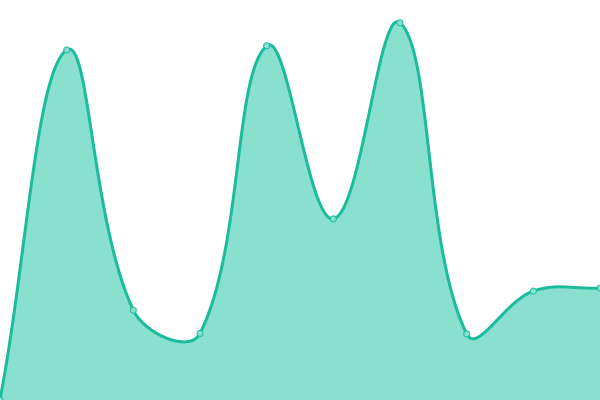
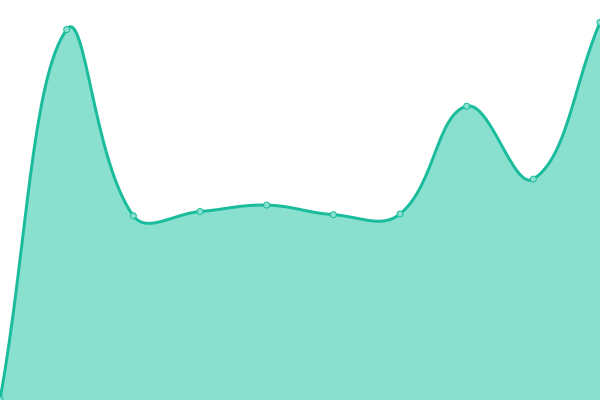
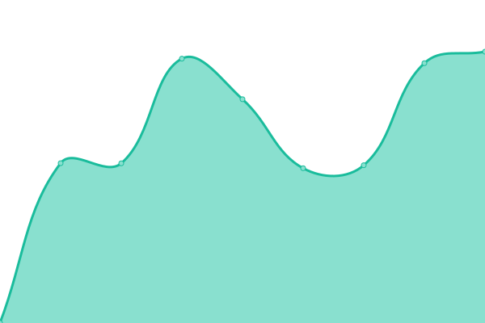

## [📈 Live Status](https://upptime.js.org): <!--live status--> **🟨 Partial outage**

<!--start: status pages-->
| URL | Status | History | Response Time | Uptime |
| --- | ------ | ------- | ------------- | ------ |
| [연세포털 - https://portal.yonsei.ac.kr/main/](https://portal.yonsei.ac.kr/main/) | 🟩 Up | [https-portal-yonsei-ac-kr-main.yml](https://github.com/belhyun/yonsei-upptime/commits/master/history/https-portal-yonsei-ac-kr-main.yml) |  1297ms | 
| [그룹웨어 - https://ysgw.yonsei.ac.kr](https://ysgw.yonsei.ac.kr) | 🟩 Up | [https-ysgw-yonsei-ac-kr.yml](https://github.com/belhyun/yonsei-upptime/commits/master/history/https-ysgw-yonsei-ac-kr.yml) |  600ms | 
| [기부금 - https://donasys.yonsei.ac.kr/donasys](https://ysgw.yonsei.ac.kr/donasys) | 🟥 Down | [https-donasys-yonsei-ac-kr-donasys.yml](https://github.com/belhyun/yonsei-upptime/commits/master/history/https-donasys-yonsei-ac-kr-donasys.yml) |  168ms | 
| [연세포털(없는 사이트로) - https://portal2.yonsei.ac.kr/main/](https://portal2.yonsei.ac.kr/main/) | 🟥 Down | [https-portal2-yonsei-ac-kr-main.yml](https://github.com/belhyun/yonsei-upptime/commits/master/history/https-portal2-yonsei-ac-kr-main.yml) |  0ms | 
<!--end: status pages-->

## 📄 License

- Code: [MIT](./LICENSE) © [Koj](https://koj.co)
- Data in the `./history` directory: [Open Database License](https://opendatacommons.org/licenses/odbl/1-0/)

  

  An open source project by <a href="https://koj.co">Koj</a>.   <a href="https://koj.co">Furnish your home in style, for as low as CHF175/month →</a>

