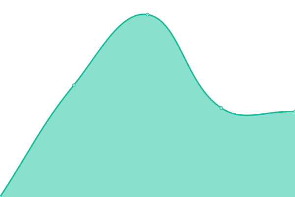

## [📈 Live Status](https://upptime.js.org): <!--live status--> **🟩 All systems operational**

<!--start: status pages-->
| URL | Status | History | Response Time | Uptime |
| --- | ------ | ------- | ------------- | ------ |
| [Portal - https://portal.yonsei.ac.kr/main/](https://portal.yonsei.ac.kr/main/) | 🟩 Up | [portal-https-portal-yonsei-ac-kr-main.yml](https://github.com/belhyun/yonsei-upptime/commits/master/history/portal-https-portal-yonsei-ac-kr-main.yml) |  1662ms | 
| [Infra - https://infra.yonsei.ac.kr](https://infra.yonsei.ac.kr) | 🟩 Up | [infra-https-infra-yonsei-ac-kr.yml](https://github.com/belhyun/yonsei-upptime/commits/master/history/infra-https-infra-yonsei-ac-kr.yml) |  1078ms | 
| [GroupWare - https://ysgw.yonsei.ac.kr](https://ysgw.yonsei.ac.kr) | 🟩 Up | [group-ware-https-ysgw-yonsei-ac-kr.yml](https://github.com/belhyun/yonsei-upptime/commits/master/history/group-ware-https-ysgw-yonsei-ac-kr.yml) |  1049ms | 
| [Erp - https://yep.yonsei.ac.kr:50001/](https://yep.yonsei.ac.kr:50001/) | 🟩 Up | [erp-https-yep-yonsei-ac-kr-50001.yml](https://github.com/belhyun/yonsei-upptime/commits/master/history/erp-https-yep-yonsei-ac-kr-50001.yml) |  2081ms | 
<!--end: status pages-->

## 📄 License

- Code: [MIT](./LICENSE) © [Koj](https://koj.co)
- Data in the `./history` directory: [Open Database License](https://opendatacommons.org/licenses/odbl/1-0/)

  

  An open source project by <a href="https://koj.co">Koj</a>.   <a href="https://koj.co">Furnish your home in style, for as low as CHF175/month →</a>

