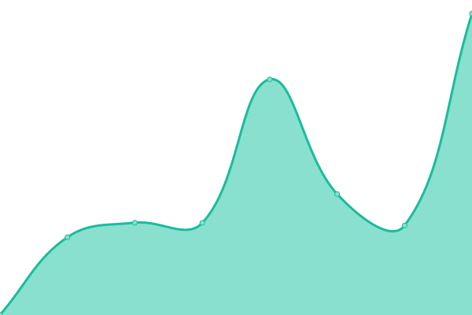
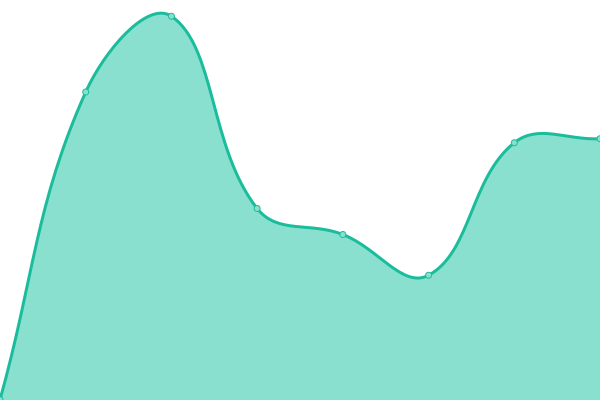
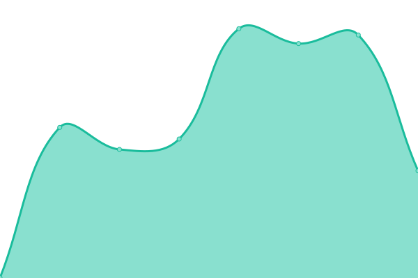
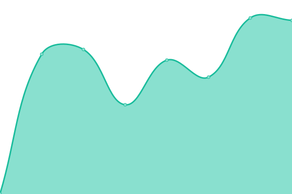
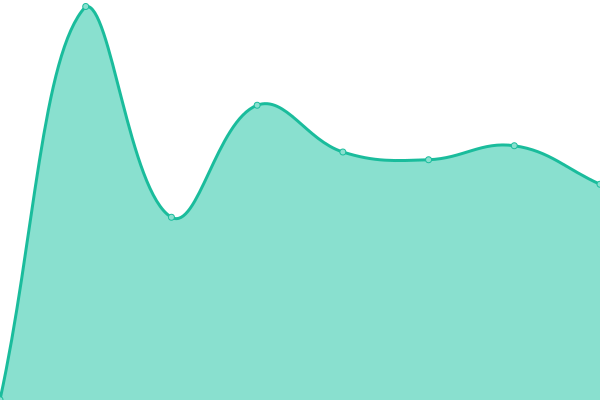
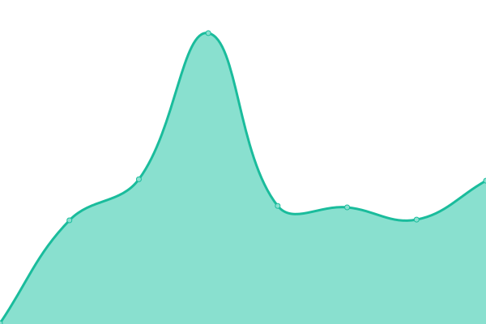

# [📈 Live Status](https://belhyun.github.io/yonsei-upptime/): <!--live status--> **🟩 All systems operational**

# [📈 Live Status](https://belhyun.github.io/yonsei-upptime/): <!--live status--> **🟩 All systems operational**

# [📈 Live Status](https://belhyun.github.io/yonsei-upptime/): <!--live status--> **🟩 All systems operational**

<!--start: status pages-->
<!-- This summary is generated by Upptime (https://github.com/upptime/upptime) -->
<!-- Do not edit this manually, your changes will be overwritten -->
<!-- prettier-ignore -->
| URL | Status | History | Response Time | Uptime |
| --- | ------ | ------- | ------------- | ------ |
|  [Portal-1(48) - https://nportal0.yonsei.ac.kr:8443/main](https://nportal0.yonsei.ac.kr:8443/main) | 🟩 Up | [portal-1-48-https-nportal0-yonsei-ac-kr-8443-main.yml](https://github.com/belhyun/yonsei-upptime/commits/HEAD/history/portal-1-48-https-nportal0-yonsei-ac-kr-8443-main.yml) | 

 1141ms
     
 | 

<a href="https://belhyun.github.io/yonsei-upptime/history/portal-1-48-https-nportal0-yonsei-ac-kr-8443-main">100.00%</a>
    

|  [Portal-2(49) - https://nportal1.yonsei.ac.kr:8443/main](https://nportal1.yonsei.ac.kr:8443/main) | 🟩 Up | [portal-2-49-https-nportal1-yonsei-ac-kr-8443-main.yml](https://github.com/belhyun/yonsei-upptime/commits/HEAD/history/portal-2-49-https-nportal1-yonsei-ac-kr-8443-main.yml) | 

 1061ms
     
 | 

<a href="https://belhyun.github.io/yonsei-upptime/history/portal-2-49-https-nportal1-yonsei-ac-kr-8443-main">100.00%</a>
    

|  [Infra-1(12) - http://ninfra0.yonsei.ac.kr:8082](http://ninfra0.yonsei.ac.kr:8082) | 🟩 Up | [infra-1-12-http-ninfra0-yonsei-ac-kr-8082.yml](https://github.com/belhyun/yonsei-upptime/commits/HEAD/history/infra-1-12-http-ninfra0-yonsei-ac-kr-8082.yml) | 

 866ms
     
 | 

<a href="https://belhyun.github.io/yonsei-upptime/history/infra-1-12-http-ninfra0-yonsei-ac-kr-8082">100.00%</a>
    

|  [Infra-2(13) - http://ninfra1.yonsei.ac.kr:8082/sso/L4_response.html](http://ninfra1.yonsei.ac.kr:8082/sso/L4_response.html) | 🟩 Up | [infra-2-13-http-ninfra1-yonsei-ac-kr-8082-sso-l4-response-html.yml](https://github.com/belhyun/yonsei-upptime/commits/HEAD/history/infra-2-13-http-ninfra1-yonsei-ac-kr-8082-sso-l4-response-html.yml) | 

 762ms
     
 | 

<a href="https://belhyun.github.io/yonsei-upptime/history/infra-2-13-http-ninfra1-yonsei-ac-kr-8082-sso-l4-response-html">100.00%</a>
    

|  [GroupWare - https://ysgw.yonsei.ac.kr](https://ysgw.yonsei.ac.kr) | 🟩 Up | [group-ware-https-ysgw-yonsei-ac-kr.yml](https://github.com/belhyun/yonsei-upptime/commits/HEAD/history/group-ware-https-ysgw-yonsei-ac-kr.yml) | 

 1104ms
     
 | 

<a href="https://belhyun.github.io/yonsei-upptime/history/group-ware-https-ysgw-yonsei-ac-kr">100.00%</a>
    

|  [Donasys - https://donasys.yonsei.ac.kr/donasys](https://donasys.yonsei.ac.kr/donasys) | 🟩 Up | [donasys-https-donasys-yonsei-ac-kr-donasys.yml](https://github.com/belhyun/yonsei-upptime/commits/HEAD/history/donasys-https-donasys-yonsei-ac-kr-donasys.yml) | 

 1368ms
     
 | 

<a href="https://belhyun.github.io/yonsei-upptime/history/donasys-https-donasys-yonsei-ac-kr-donasys">99.79%</a>
    

|  [Tams - https://tams.yonsei.ac.kr:8443/](https://tams.yonsei.ac.kr:8443/) | 🟩 Up | [tams-https-tams-yonsei-ac-kr-8443.yml](https://github.com/belhyun/yonsei-upptime/commits/HEAD/history/tams-https-tams-yonsei-ac-kr-8443.yml) | 

 1377ms
     
 | 

<a href="https://belhyun.github.io/yonsei-upptime/history/tams-https-tams-yonsei-ac-kr-8443">100.00%</a>
    

|  [Sms - https://message.yonsei.ac.kr/include/noPermission.jsp](https://message.yonsei.ac.kr/include/noPermission.jsp) | 🟩 Up | [sms-https-message-yonsei-ac-kr-include-no-permission-jsp.yml](https://github.com/belhyun/yonsei-upptime/commits/HEAD/history/sms-https-message-yonsei-ac-kr-include-no-permission-jsp.yml) | 

 992ms
     
 | 

<a href="https://belhyun.github.io/yonsei-upptime/history/sms-https-message-yonsei-ac-kr-include-no-permission-jsp">100.00%</a>
    

|  [Sugang(undergraduate)](https://ysweb.yonsei.ac.kr/websquare/websquare.jsp?w2xPath=/wq/login/hakbu_login.xml) | 🟩 Up | [sugang-undergraduate.yml](https://github.com/belhyun/yonsei-upptime/commits/HEAD/history/sugang-undergraduate.yml) | 

 1039ms
     
 | 

<a href="https://belhyun.github.io/yonsei-upptime/history/sugang-undergraduate">100.00%</a>
    

|  [Sugang(graduate)](https://ysweb.yonsei.ac.kr/graduate.jsp) | 🟩 Up | [sugang-graduate.yml](https://github.com/belhyun/yonsei-upptime/commits/HEAD/history/sugang-graduate.yml) | 

 178ms
     
 | 

<a href="https://belhyun.github.io/yonsei-upptime/history/sugang-graduate">100.00%</a>
    

|  [Grade - https://ysweb.yonsei.ac.kr/grade.jsp](https://ysweb.yonsei.ac.kr/grade.jsp) | 🟩 Up | [grade-https-ysweb-yonsei-ac-kr-grade-jsp.yml](https://github.com/belhyun/yonsei-upptime/commits/HEAD/history/grade-https-ysweb-yonsei-ac-kr-grade-jsp.yml) | 

 174ms
     
 | 

<a href="https://belhyun.github.io/yonsei-upptime/history/grade-https-ysweb-yonsei-ac-kr-grade-jsp">100.00%</a>
    

<!--end: status pages-->

## 📄 License

- Code: [MIT](./LICENSE) © [belhyun](http://belhyun.blogspot.com)
- Data in the `./history` directory: [Open Database License](https://opendatacommons.org/licenses/odbl/1-0/)

  

  An open source project by <a href="https://koj.co">Koj</a>.   <a href="https://koj.co">Furnish your home in style, for as low as CHF175/month →</a>

