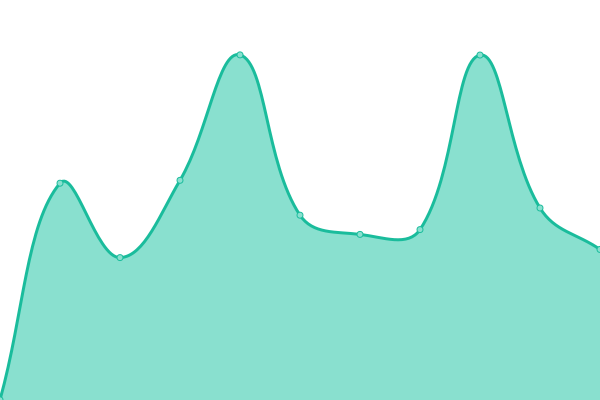

# [📈 Live Status](https://belhyun.github.io/yonsei-upptime/): <!--live status--> **🟩 All systems operational**

# [📈 Live Status](https://belhyun.github.io/yonsei-upptime/): <!--live status--> **🟩 All systems operational**

# [📈 Live Status](https://belhyun.github.io/yonsei-upptime/): <!--live status--> **🟩 All systems operational**

<!--start: status pages-->
<!-- This summary is generated by Upptime (https://github.com/upptime/upptime) -->
<!-- Do not edit this manually, your changes will be overwritten -->
<!-- prettier-ignore -->
| URL | Status | History | Response Time | Uptime |
| --- | ------ | ------- | ------------- | ------ |
| [Portal - https://portal.yonsei.ac.kr/main/](https://portal.yonsei.ac.kr/main/) | 🟩 Up | [portal-https-portal-yonsei-ac-kr-main.yml](https://github.com/belhyun/yonsei-upptime/commits/master/history/portal-https-portal-yonsei-ac-kr-main.yml) | 

 2384ms
     
 | 

   

| [Infra - https://infra.yonsei.ac.kr](https://infra.yonsei.ac.kr) | 🟩 Up | [infra-https-infra-yonsei-ac-kr.yml](https://github.com/belhyun/yonsei-upptime/commits/master/history/infra-https-infra-yonsei-ac-kr.yml) | 

 1471ms
     
 | 

   

| [GroupWare - https://ysgw.yonsei.ac.kr](https://ysgw.yonsei.ac.kr) | 🟩 Up | [group-ware-https-ysgw-yonsei-ac-kr.yml](https://github.com/belhyun/yonsei-upptime/commits/master/history/group-ware-https-ysgw-yonsei-ac-kr.yml) | 

 1307ms
     
 | 

   

| [Donasys - https://donasys.yonsei.ac.kr/donasys](https://donasys.yonsei.ac.kr/donasys) | 🟩 Up | [donasys-https-donasys-yonsei-ac-kr-donasys.yml](https://github.com/belhyun/yonsei-upptime/commits/master/history/donasys-https-donasys-yonsei-ac-kr-donasys.yml) | 

 1453ms
     
 | 

   

| [Tams - https://tams.yonsei.ac.kr:8443/](https://tams.yonsei.ac.kr:8443/) | 🟩 Up | [tams-https-tams-yonsei-ac-kr-8443.yml](https://github.com/belhyun/yonsei-upptime/commits/master/history/tams-https-tams-yonsei-ac-kr-8443.yml) | 

 1307ms
     
 | 

   

| [Sms - https://message.yonsei.ac.kr/include/noPermission.jsp](https://message.yonsei.ac.kr/include/noPermission.jsp) | 🟩 Up | [sms-https-message-yonsei-ac-kr-include-no-permission-jsp.yml](https://github.com/belhyun/yonsei-upptime/commits/master/history/sms-https-message-yonsei-ac-kr-include-no-permission-jsp.yml) | 

 979ms
     
 | 

   

| [Sugang(undergraduate)](https://ysweb.yonsei.ac.kr/websquare/websquare.jsp?w2xPath=/wq/login/hakbu_login.xml) | 🟩 Up | [sugang-undergraduate.yml](https://github.com/belhyun/yonsei-upptime/commits/master/history/sugang-undergraduate.yml) | 

 1034ms
     
 | 

   

| [Sugang(graduate)](https://ysweb.yonsei.ac.kr/graduate.jsp) | 🟩 Up | [sugang-graduate.yml](https://github.com/belhyun/yonsei-upptime/commits/master/history/sugang-graduate.yml) | 

 165ms
     
 | 

   

| [Grade - https://ysweb.yonsei.ac.kr/grade.jsp](https://ysweb.yonsei.ac.kr/grade.jsp) | 🟩 Up | [grade-https-ysweb-yonsei-ac-kr-grade-jsp.yml](https://github.com/belhyun/yonsei-upptime/commits/master/history/grade-https-ysweb-yonsei-ac-kr-grade-jsp.yml) | 

 165ms
     
 | 

   

<!--end: status pages-->

## 📄 License

- Code: [MIT](./LICENSE) © [belhyun](http://belhyun.blogspot.com)
- Data in the `./history` directory: [Open Database License](https://opendatacommons.org/licenses/odbl/1-0/)

  

  An open source project by <a href="https://koj.co">Koj</a>.   <a href="https://koj.co">Furnish your home in style, for as low as CHF175/month →</a>

