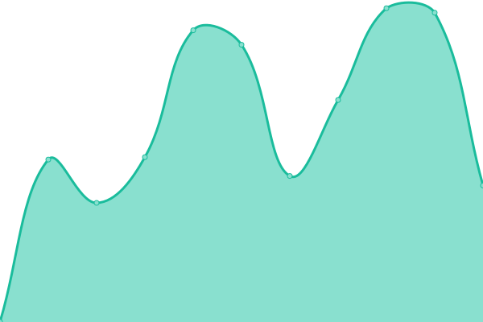
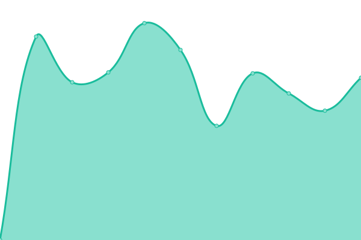
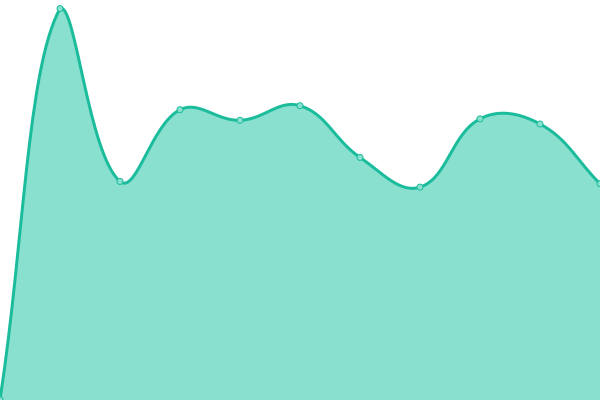
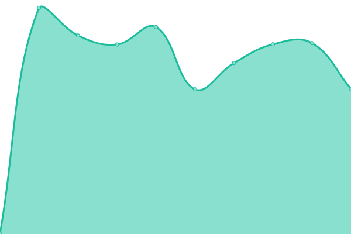

# [📈 Live Status](https://belhyun.github.io/yonsei-upptime/): <!--live status--> **🟨 Partial outage**

# [📈 Live Status](https://belhyun.github.io/yonsei-upptime/): <!--live status--> **🟨 Partial outage**

# [📈 Live Status](https://belhyun.github.io/yonsei-upptime/): <!--live status--> **🟨 Partial outage**

<!--start: status pages-->
<!-- This summary is generated by Upptime (https://github.com/upptime/upptime) -->
<!-- Do not edit this manually, your changes will be overwritten -->

| URL                                                                                                                  | Status  | History                                                                                                                                                                                       | Response Time                                                                                                                 | Uptime                                                                                                                                                                                                                                                                                                                         |
| -------------------------------------------------------------------------------------------------------------------- | ------- | --------------------------------------------------------------------------------------------------------------------------------------------------------------------------------------------- | ----------------------------------------------------------------------------------------------------------------------------- | ------------------------------------------------------------------------------------------------------------------------------------------------------------------------------------------------------------------------------------------------------------------------------------------------------------------------------ |
| [Portal - https://portal.yonsei.ac.kr/main/](https://portal.yonsei.ac.kr/main/)                                      | 🟩 Up   | [portal-https-portal-yonsei-ac-kr-main.yml](https://github.com/belhyun/yonsei-upptime/commits/master/history/portal-https-portal-yonsei-ac-kr-main.yml)                                       |  2087ms                   |                                        |
| [Infra - https://infra.yonsei.ac.kr](https://infra.yonsei.ac.kr)                                                     | 🟥 Down | [infra-https-infra-yonsei-ac-kr.yml](https://github.com/belhyun/yonsei-upptime/commits/master/history/infra-https-infra-yonsei-ac-kr.yml)                                                     |  1359ms                          |                                                      |
| [GroupWare - https://ysgw.yonsei.ac.kr](https://ysgw.yonsei.ac.kr)                                                   | 🟩 Up   | [group-ware-https-ysgw-yonsei-ac-kr.yml](https://github.com/belhyun/yonsei-upptime/commits/master/history/group-ware-https-ysgw-yonsei-ac-kr.yml)                                             |  1174ms                      |                                              |
| [Donasys - https://donasys.yonsei.ac.kr/donasys](https://donasys.yonsei.ac.kr/donasys)                               | 🟩 Up   | [donasys-https-donasys-yonsei-ac-kr-donasys.yml](https://github.com/belhyun/yonsei-upptime/commits/master/history/donasys-https-donasys-yonsei-ac-kr-donasys.yml)                             |  1326ms              |                              |
| [Tams - https://tams.yonsei.ac.kr:8443/](https://tams.yonsei.ac.kr:8443/)                                            | 🟩 Up   | [tams-https-tams-yonsei-ac-kr-8443.yml](https://github.com/belhyun/yonsei-upptime/commits/master/history/tams-https-tams-yonsei-ac-kr-8443.yml)                                               |  1153ms                       |                                                |
| [Sms - https://message.yonsei.ac.kr/include/noPermission.jsp](https://message.yonsei.ac.kr/include/noPermission.jsp) | 🟩 Up   | [sms-https-message-yonsei-ac-kr-include-no-permission-jsp.yml](https://github.com/belhyun/yonsei-upptime/commits/master/history/sms-https-message-yonsei-ac-kr-include-no-permission-jsp.yml) |  961ms |  |
| [Sugang(undergraduate)](https://ysweb.yonsei.ac.kr/websquare/websquare.jsp?w2xPath=/wq/login/hakbu_login.xml)        | 🟩 Up   | [sugang-undergraduate.yml](https://github.com/belhyun/yonsei-upptime/commits/master/history/sugang-undergraduate.yml)                                                                         |  964ms                                     |                                                                          |
| [Sugang(graduate)](https://ysweb.yonsei.ac.kr/graduate.jsp)                                                          | 🟩 Up   | [sugang-graduate.yml](https://github.com/belhyun/yonsei-upptime/commits/master/history/sugang-graduate.yml)                                                                                   |  149ms                                          |                                                                                    |
| [Grade - https://ysweb.yonsei.ac.kr/grade.jsp](https://ysweb.yonsei.ac.kr/grade.jsp)                                 | 🟩 Up   | [grade-https-ysweb-yonsei-ac-kr-grade-jsp.yml](https://github.com/belhyun/yonsei-upptime/commits/master/history/grade-https-ysweb-yonsei-ac-kr-grade-jsp.yml)                                 |  149ms                 |                                  |

<!--end: status pages-->

## 📄 License

- Code: [MIT](./LICENSE) © [belhyun](http://belhyun.blogspot.com)
- Data in the `./history` directory: [Open Database License](https://opendatacommons.org/licenses/odbl/1-0/)

  

  An open source project by <a href="https://koj.co">Koj</a>.   <a href="https://koj.co">Furnish your home in style, for as low as CHF175/month →</a>

